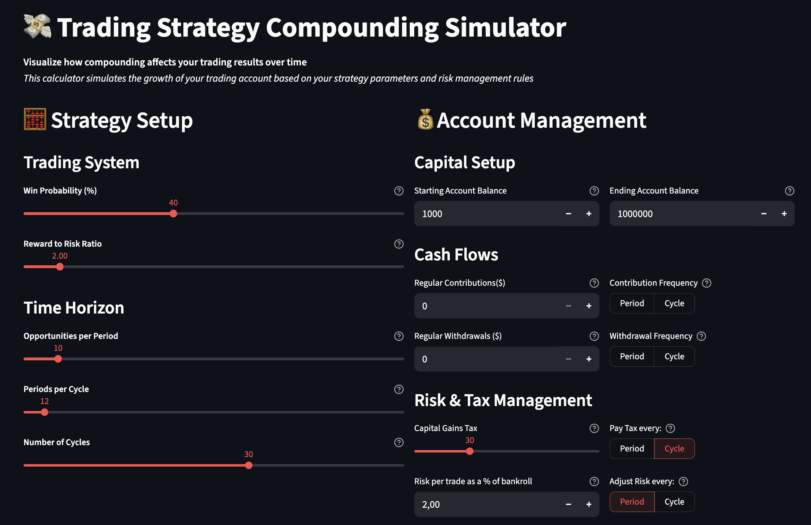
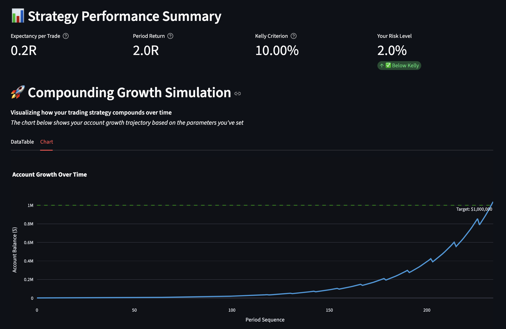

# Compound Interest Calculator

A simple Streamlit app to visualize how compounding affects trading results over time.
This calculator simulates the growth of a trading account based on your strategy parameters, expectancy, and risk management rules.

---

## 🚀 Demo

Live demo: *https://compounding-simulator.clocktrades.com/* 

Other streamlit demos:
- https://performance-visualizer.clocktrades.com/
- https://expectancy-and-kelly-calculator.clocktrades.com/

---

## 🎯 Why this project

This tool is designed for traders who want to understand the power of compounding applied to their strategies:
- Adapted Formula:
	A = P × (1 + r/n)^(n×t)
- A: Ending balance
- P: Starting balance
- r: Expected return per period (based on expectancy)
- n: Number of compounding periods per cycle
- t: Number of cycles
- Trading context: We compound risk per trade (as % of balance), adjusted for wins, losses, taxes, and cash flows.
- Benefits:
  1. Quickly visualize long-term account growth.
  2. Experiment with different strategies & risk parameters.
  3. Learn how expectancy and Kelly Criterion influence outcomes.

---

## 🛠 Tech Stack

- **Backend:** Streamlit  
- **Frontend:** Streamlit
- **Libraries:** Pandas, Numpy, Matplotlip  

---

## ✨ Features

- ✅ Interactive compound interest simulation for trading
- ✅ Adjustable starting balance, target balance, risk % per trade, and number of trades
- ✅ Displays Expectancy and Kelly Criterion values
- ✅ Interactive charts to visualize balance growth
- ✅ Simple, lightweight, no database required
---


| Input                              | Growth Simulation                      |
|------------------------------------|----------------------------------------|
|  |  |


---

## ⚡ Getting Started (Local)

1. Clone the repository:
    ```bash
    git clone <repo_url>
    ```
2. Create a virtual environment and install dependencies:
    ```bash
	  python -m venv venv
	  source venv/bin/activate  # on macOS/Linux
	  venv\Scripts\activate     # on Windows
	  pip install -r requirements.txt
    ```

3. Run the application:
    ```bash
	  streamlit run app.py    
    ```

4. Open in your browser:
	```bash
	http://localhost:8501
	```

---

## 📜 License

MIT

---

